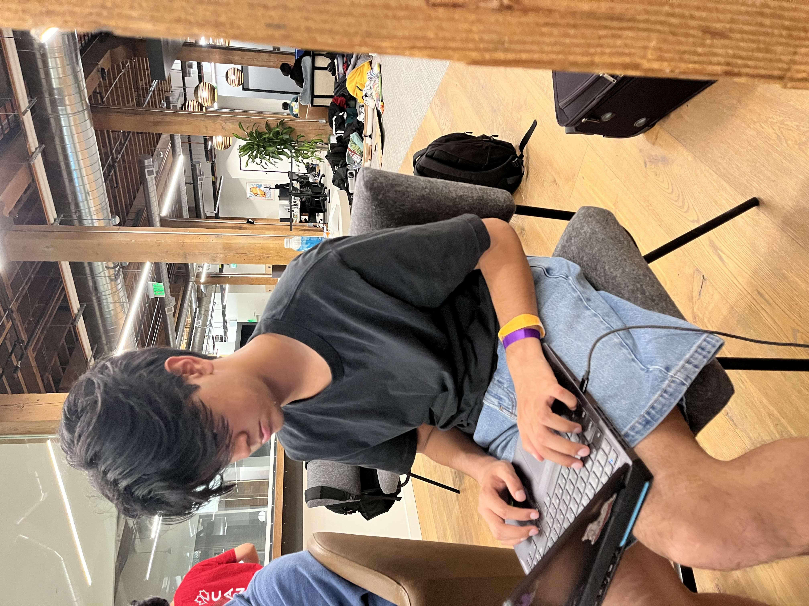
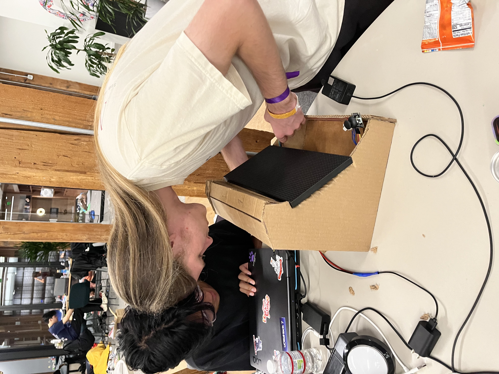
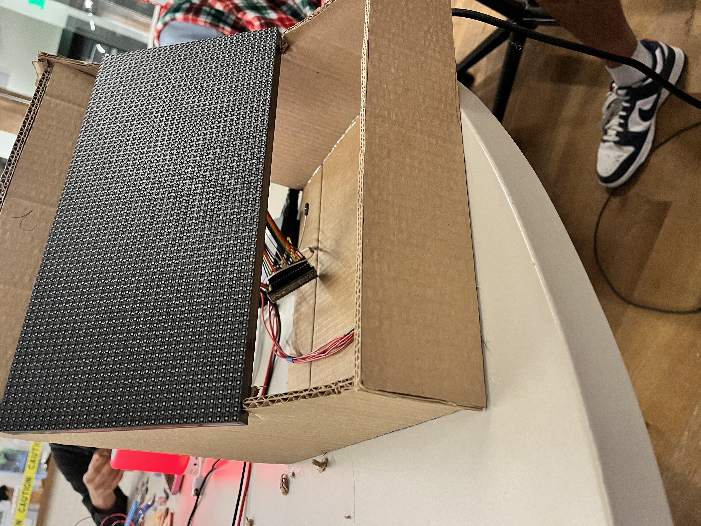

# arcadetris

**arcadetris** is a retro-inspired, two-player Tetris arcade game built from scratch in a custom-designed cardboard cabinet modeled in Fusion 360, this project brings the nostalgic charm of classic arcade gaming into a DIY form.

## Features

* **Two-player gameplay** with physical controls
* **Retro arcade-style design** crafted in cardboard using CAD
* **High-brightness HUB75D LED matrix display**
* **Custom microcontroller board** (Orhpico, a modified Raspberry Pi Pico 2)
* **Powered by a 9W USB-C charger** with direct soldered connections
* **Fully functional joysticks and switches** for intuitive piece movement and rotation

## Hardware

* **Display**: HUB75D RGB matrix

  * Challenges: Requires 5V at 4A for optimal performance
  * Workaround: Lowered refresh rate to achieve minimal functionality
  * Important: All pins **must be soldered** for a reliable connection
* **Microcontroller**: Orhpico (custom variant of the Raspberry Pi Pico 2)
* **Power Supply**: USB-C charger (9W) connected via custom soldered adapter
* **Controls**:

  * switches for left/right movement
  * joystick for rotation

## Software

* Built  using **Arduino IDE**
* **Adafruit Protomatter library** used to control the HUB75D display
* Game logic written in C++
* joystick and button handwired to the oprhpico. 

## CAD Design

* Cabinet modeled in **Fusion 360** to replicate the look and feel of retro arcade machines
* Constructed out of **cardboard** for quick prototyping and portability

## Images

Peak posture (software man def not vibe coded)
* 

More peak posture
* 

Note: this does work, however pretty much impossible to get a video, if you take too long to take a picture you might get a seizure
* 

Start menu:

Game in play:
* 

## Build Notes

* Please do not use Hub75d for this. On the github it says many features are in progress and it is very new
* Cad was based off inaccurate dimmensions for the hub, it is scaleable and can be slotted in easily. 
* Heavy on the seizure warning, this is cooked. 

## Demo 
https://youtube.com/shorts/YQOdSCr6gd4?feature=share

